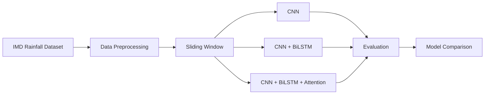

<div align="center">

# 🌧️ Explainable Deep Learning Framework for Spatial Rainfall Prediction over India

### CNN • CNN + BiLSTM • CNN + BiLSTM + Attention


Predicting **next-day spatial rainfall over India** using deep learning and historical IMD rainfall observations.

</div>

---

# 📌 Overview

This repository presents a deep learning framework for **next-day spatial rainfall prediction** across the entire Indian subcontinent using the **India Meteorological Department (IMD) Gridded Rainfall Dataset**.

Unlike traditional rainfall forecasting approaches that predict rainfall at individual weather stations, this project predicts rainfall over the complete **129 × 135 spatial grid**, generating a rainfall map for the following day.

Three deep learning architectures are implemented and compared under identical experimental settings:

| Model | Purpose |
|-------|---------|
| CNN | Spatial feature learning |
| CNN + BiLSTM | Spatial + Temporal learning |
| CNN + BiLSTM + Attention | Spatial + Temporal + Attention learning |

The project investigates whether temporal learning and attention mechanisms improve rainfall prediction compared to a CNN baseline.

---

# ✨ Key Features

- 🌧️ Spatial rainfall prediction over India
- 🛰 IMD Gridded Rainfall Dataset (2000–2024)
- 🧠 CNN, CNN+BiLSTM and Attention models
- 📈 Automatic model comparison
- 📊 Performance evaluation using MAE, MSE, RMSE and R²
- 📉 Training curves and loss visualization
- 🗺 Prediction maps and error heatmaps
- 📄 Research-oriented implementation
- 🚀 PyTorch-based deep learning pipeline

---

# 🌍 Study Area

| Property | Value |
|----------|-------|
| Country | India |
| Dataset | IMD Gridded Rainfall |
| Years | 2000–2024 |
| Resolution | 129 × 135 |
| Prediction | Next-Day Rainfall |
| Framework | PyTorch |

---

# 📂 Project Workflow



---

# 🧠 Model Architecture


---

# 📊 Dataset

The framework utilizes the **India Meteorological Department (IMD) Gridded Rainfall Dataset**, containing daily rainfall observations over India.

| Property | Value |
|----------|-------|
| Source | IMD |
| Data Type | Daily Rainfall |
| Period | 2000–2024 |
| Format | NetCDF (.nc) |
| Grid Size | 129 × 135 |

### Input

```
Previous 7 Days Rainfall Maps
```

Shape

```python
(Batch, 7, 1, 129, 135)
```

### Output

```
Next-Day Rainfall Map
```

Shape

```python
(Batch, 1, 129, 135)
```

---

# 📁 Repository Structure

```text
Rainfall-Prediction-DeepLearning
│
├── data/
├── processed_data/
├── notebooks/
├── models/
├── utils/
├── results/
├── figures/
├── saved_models/
├── paper/
├── requirements.txt
└── README.md
```

---

# 🚀 Deep Learning Pipeline

```
Raw Rainfall Data
        │
        ▼
 Data Cleaning
        │
        ▼
Normalization
        │
        ▼
Sliding Window
        │
        ▼
Train / Validation / Test
        │
        ▼
Deep Learning Models
        │
        ▼
Prediction
        │
        ▼
Evaluation
```

---

# 📈 Experimental Results

| Model | MAE ↓ | MSE ↓ | RMSE ↓ | R² ↑ |
|------|------:|------:|------:|------:|
| CNN | 0.001727 | **0.000030** | **0.005500** | **0.297333** |
| CNN + BiLSTM | **0.001329** | 0.000032 | 0.005696 | 0.246329 |
| CNN + BiLSTM + Attention | 0.001451 | 0.000040 | 0.006293 | 0.080025 |

---

# 🏆 Key Findings

- ✅ CNN achieved the **lowest MSE and RMSE**
- ✅ CNN achieved the **highest R² score**
- ✅ CNN + BiLSTM obtained the **lowest MAE**
- ✅ Attention increased model complexity but did not improve prediction accuracy on the current dataset.

---
# 📊 Visual Results

The framework automatically generates publication-quality visualizations during model evaluation.

## CNN Baseline

| Training Curve | Prediction | Error Heatmap |
|----------------|------------|---------------|
|  |  |  |

---

## CNN + BiLSTM

| Training Curve | Prediction | Error Heatmap |
|----------------|------------|---------------|
|  |  |  |

---

## CNN + BiLSTM + Attention

| Training Curve | Prediction | Error Heatmap |
|----------------|------------|---------------|
|  |  |  |

---

# 📈 Performance Comparison

| Metric | CNN | CNN + BiLSTM | CNN + BiLSTM + Attention |
|:-------:|:---:|:------------:|:------------------------:|
| MAE | 0.001727 | **0.001329** | 0.001451 |
| MSE | **0.000030** | 0.000032 | 0.000040 |
| RMSE | **0.005500** | 0.005696 | 0.006293 |
| R² | **0.297333** | 0.246329 | 0.080025 |

---

# 📌 Model Comparison Summary

| Feature | CNN | CNN + BiLSTM | CNN + BiLSTM + Attention |
|----------|:---:|:------------:|:------------------------:|
| Spatial Learning | ✅ | ✅ | ✅ |
| Temporal Learning | ❌ | ✅ | ✅ |
| Attention | ❌ | ❌ | ✅ |
| Parameters | Low | Medium | High |
| Training Time | Fast | Medium | Slow |
| Overall Performance | ⭐⭐⭐⭐⭐ | ⭐⭐⭐⭐ | ⭐⭐⭐ |

---

# 🖥️ Training Configuration

| Parameter | Value |
|-----------|-------|
| Framework | PyTorch |
| Optimizer | Adam |
| Loss Function | MSELoss |
| Learning Rate | 0.001 |
| Batch Size | 8 |
| Epochs | 30 |
| Early Stopping | Patience = 5 |
| Dataset | IMD Gridded Rainfall |
| Prediction Window | Previous 7 Days |

---

# 🚀 Getting Started

## Clone Repository

```bash
git clone https://github.com/ashutosh2453/Rainfall-Prediction-DeepLearning.git

cd Rainfall-Prediction-DeepLearning
```

---

## Create Virtual Environment

Windows

```bash
python -m venv venv
venv\Scripts\activate
```

Linux / macOS

```bash
python3 -m venv venv
source venv/bin/activate
```

---

## Install Dependencies

```bash
pip install -r requirements.txt
```

---

# ▶️ Usage

Run the notebooks sequentially.

```text
01_Data_Preprocessing.ipynb

↓

02_CNN_Baseline.ipynb

↓

03_CNN_BiLSTM.ipynb

↓

04_CNN_BiLSTM_Attention.ipynb
```

---

# 📂 Generated Outputs

The project automatically generates

```text
saved_models/
│── cnn_baseline.pth
│── cnn_bilstm.pth
│── cnn_bilstm_final.pth

results/
│── cnn_metrics.csv
│── cnn_training_history.csv
│── cnn_bilstm_metrics.csv
│── cnn_bilstm_attention_metrics.csv

figures/
│── cnn_training_curve.png
│── cnn_prediction.png
│── cnn_error.png
│── cnn_bilstm_training_curve.png
│── cnn_bilstm_prediction.png
│── cnn_bilstm_error.png
│── cnn_bilstm_attention_training_curve.png
│── cnn_bilstm_attention_prediction.png
│── cnn_bilstm_attention_error.png
```

---

# 🔬 Future Work

- Integrate Minimum and Maximum Temperature
- Incorporate Humidity, Pressure and Wind Speed
- Evaluate ConvLSTM and Vision Transformers
- Add Explainable AI using SHAP and Grad-CAM
- Multi-day rainfall forecasting
- Real-time inference pipeline
- Web dashboard for rainfall visualization

---

# 📚 Citation

If you use this work in your research, please cite:

```bibtex
@article{chauhan2026,
  title={Explainable Deep Learning Framework for Spatial Rainfall Prediction over India},
  author={Ashutosh Chauhan},
  journal={Under Review},
  year={2026}
}
```

---

# 👨‍💻 Author

**Ashutosh Chauhan**

🎓 B.Tech Computer Science & Engineering (AI & ML)

🏛️ SRM Institute of Science and Technology

🔬 Summer Research Intern

Centre of Excellence in Product Design and Smart Manufacturing (CEPDSM)

Maulana Azad National Institute of Technology (MANIT), Bhopal

---

# 📜 License

This project is licensed under the **MIT License**.

---

<div align="center">

### ⭐ If you found this repository useful, please consider giving it a star!

**Made with ❤️ using PyTorch for AI-driven Rainfall Prediction**

</div>
---

# 📋 Notebook Summary

| Notebook | Description | Status |
|----------|-------------|:------:|
| 01_Data_Preprocessing.ipynb | Data cleaning, normalization, sliding window generation | ✅ |
| 02_CNN_Baseline.ipynb | CNN model training and evaluation | ✅ |
| 03_CNN_BiLSTM.ipynb | CNN + BiLSTM training and evaluation | ✅ |
| 04_CNN_BiLSTM_Attention.ipynb | CNN + BiLSTM + Attention training and evaluation | ✅ |

---

# 📌 Repository Statistics

| Item | Details |
|------|---------|
| Programming Language | Python |
| Deep Learning Framework | PyTorch |
| Dataset | IMD Gridded Rainfall |
| Study Area | India |
| Time Period | 2000–2024 |
| Input Sequence | Previous 7 Days |
| Output | Next-Day Rainfall Map |
| Grid Resolution | 129 × 135 |
| Models | 3 |
| Evaluation Metrics | MAE, MSE, RMSE, R² |

---

# 🛣️ Project Roadmap

- [x] Data Collection
- [x] Data Cleaning
- [x] Data Normalization
- [x] Sliding Window Generation
- [x] CNN Baseline
- [x] CNN + BiLSTM
- [x] CNN + BiLSTM + Attention
- [x] Model Comparison
- [x] Performance Evaluation
- [x] Research Paper Preparation
- [ ] Explainable AI (SHAP / Grad-CAM)
- [ ] Transformer-based Rainfall Prediction
- [ ] Web Deployment

---

# 🌟 Research Contributions

- Developed an end-to-end deep learning framework for spatial rainfall prediction.
- Compared CNN, CNN + BiLSTM, and CNN + BiLSTM + Attention under identical experimental settings.
- Generated publication-quality visualizations including training curves, prediction maps, and error heatmaps.
- Demonstrated that the CNN baseline achieved the strongest overall performance on the current dataset, while CNN + BiLSTM achieved the lowest MAE.

---

# 📂 Complete Repository

```text
Rainfall-Prediction-DeepLearning/
│
├── data/
│   ├── Rainfall/
│   ├── MaxTemp/
│   └── MinTemp/
│
├── processed_data/
│
├── notebooks/
│   ├── 01_Data_Preprocessing.ipynb
│   ├── 02_CNN_Baseline.ipynb
│   ├── 03_CNN_BiLSTM.ipynb
│   └── 04_CNN_BiLSTM_Attention.ipynb
│
├── models/
│   ├── cnn.py
│   ├── cnn_bilstm.py
│   └── cnn_bilstm_attention.py
│
├── utils/
│
├── saved_models/
│
├── figures/
│
├── results/
│
├── paper/
│
├── requirements.txt
├── LICENSE
└── README.md
```

---

# 🤝 Acknowledgements

This work was developed as part of a research project on deep learning-based rainfall prediction. The implementation utilizes the **India Meteorological Department (IMD) Gridded Rainfall Dataset** and open-source Python libraries including **PyTorch**, **NumPy**, **Pandas**, and **Scikit-learn**.

Special thanks to the research mentors and faculty members who provided valuable guidance throughout the project.

---

# 📬 Contact

**Ashutosh Chauhan**

🎓 B.Tech CSE (AI & ML)

SRM Institute of Science and Technology

📧 Email: *your-email@example.com*

🔗 GitHub: https://github.com/ashutosh2453

---

<div align="center">

## ⭐ Support the Project

If you found this project helpful, please consider giving it a **⭐ Star** on GitHub.

It helps others discover the project and supports future research.

---

**Made with ❤️ using PyTorch**

</div>
